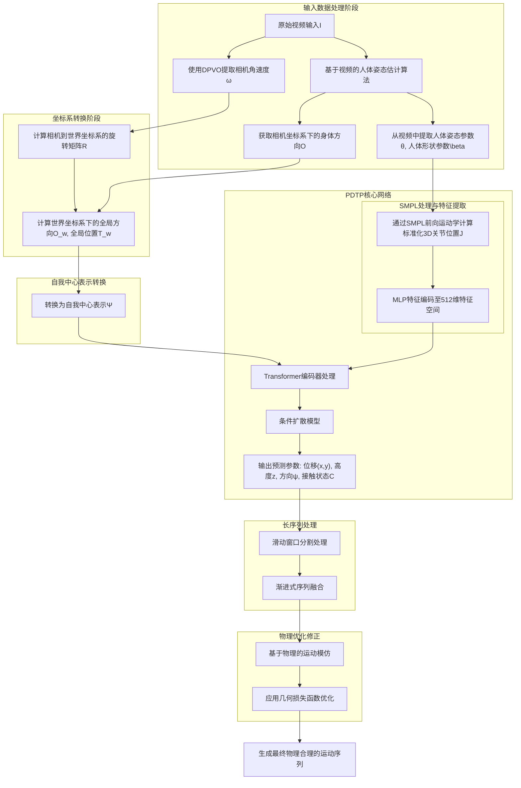
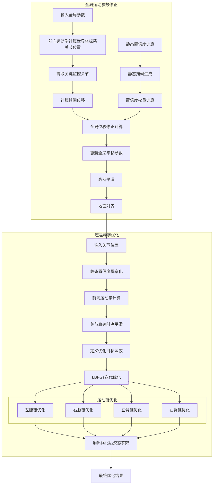

# 用于世界坐标系下运动重建的基于概率扩散模型的轨迹先验

<!-- Probabilistic Diffusion-based Trajectory Prior (PDTP) -->

如图所示，我们方法的核心思想是通过条件概率模型来解决预测中的模糊性和信息不完整问题。据此，我们提出了PDTP(Probabilistic Diffusion-based Trajectory Prior)，这是一个用于估计世界坐标系下轨迹的先验模型，能够预测全局根节点平移和方向。PDTP以预测的人体姿态、相机坐标系下的身体方向以及来自DPVO的相机角度作为输入，通过扩散模型预测世界坐标系下的人体轨迹。这种方法能够对复杂的数据分布进行建模，并在世界坐标系下生成高质量的人体运动轨迹。

**轨迹预测中的固有歧义性分析与生成式建模的动机**
轨迹预测中存在的两个基本歧义来源：1. 首先是焦距歧义。当物体在不同距离处以不同焦距拍摄时，可能在图像平面上产生完全相同的投影。这种透视投影的特性导致了从图像到三维空间的一对多映射关系。2. 其次是视觉里程计中的尺度歧义。尽管视觉里程计技术能够准确捕捉相机的相对加速度，但在位移估计方面存在着固有的尺度不确定性。这种尺度上的不确定性进一步传递到人体轨迹预测中，使得观测数据与可能的轨迹之间形成多对多的映射关系。3. 这些视觉轨迹预测任务中的固有歧义性，自然而然地引导我们采用生成式和概率建模方法。这类方法特别适合处理解空间中存在的多对多和一对多映射关系。这是因为生成式模型能够通过对概率分布的建模，有效地表达和处理这种预测任务中的不确定性。

同时我们提出一个可微分的物理合理性修正模块，用于进一步降低Body pose和对应的根关节点轨迹组合成的motion的物理合理性，包括脚滑步和浮空问题。通过前面PDTP预测的末端关节点和环境的接触信息，在一个基于优化的可微分优化模块中进行逆运动学解算，来得到物理修正后的motion。

这基于一个比较明显的事实：人的运动轨迹包括运动状态和人在局部坐标系下的姿态高度相关。由此我们可以很容易得从局部姿态中去推断出人的根关节点（也就是髋骨位置）的运动轨迹以及人各个关节点和场景的接触状态（身体的末端关节点和地面的接触状态信息，也就是左右脚趾、脚跟、膝盖和手和场景包括地面和物体的交互信息）。

### 技术领域

本发明涉及计算机视觉和人体姿态估计技术领域，具体涉及一种基于扩散模型的世界坐标系人体轨迹预测系统及方法。该系统可以有效处理运动预测中的不确定性问题，实现准确的世界坐标系轨迹重建。

### 背景技术

现有的人体运动预测技术在处理动态相机视频时面临重要挑战。由于相机运动和焦距变化带来的尺度模糊性，以及单目视觉里程计固有的尺度不确定性，使得准确估计世界坐标系下的人体轨迹变得困难。现有方法往往采用确定性的预测模型，无法有效处理这些本质的不确定性，导致预测结果缺乏稳定性和准确性。

## 预备知识

输入数据为从互联网获取的T帧原始视频 $I^{1:T}$，其中大多数包含移动相机运动（dynamic camera）。在相机空间中估计得到人体姿态 $\Theta = \theta^{1:T} \in \mathbb{R}^{21\times6}$ 和朝向（orientation） $O_{cam}^{1:T} \in \mathbb{R}^6$ 后，我们的目标是估计全局轨迹 $\{(\tau^{1:T}, \gamma^{1:T})\}$，其中包括全局坐标系下的根节点平移 $\tau \in \mathbb{R}^3$ 和方向 $\gamma \in \mathbb{R}^6$，以及8个末端关节点的接触状态$C^{1:T}_{1:K}$，且$K=8$, $C \in \{0,1\}$是一个二值标签。

**扩散模型(DM)的核心原理**是构建一个渐进式噪声扩散过程及其逆过程来建模概率分布。在实际应用中，对于采样自真实分布的数据点 $\mathbf{x} \sim p_{\text{data}}$，通过构造马尔可夫链来实现前向扩散过程，该过程逐步注入高斯噪声：

$$q(\mathbf{x}_t \mid \mathbf{x}_{t-1}) = \mathcal{N}(\mathbf{x}_t; \sqrt{1 - \beta_t}\mathbf{x}_{t-1}, \beta_t\mathbf{I})$$

在该框架中，$t = 1, \ldots, T$ 定义了扩散步长，$\mathbf{x}_t$ 代表经过 $t$ 步扩散后的噪声数据。基于高斯分布的特性，可以直接构建从初始状态 $\mathbf{x}_0$ 到任意时刻 $\mathbf{x}_t$ 的闭式解：

$$q(\mathbf{x}_t \mid \mathbf{x}_0) = \mathcal{N}(\mathbf{x}_t; \sqrt{\bar{\alpha}_t}\mathbf{x}_0, (1 - \bar{\alpha}_t)\mathbf{I})$$

其中累积系数 $\bar{\alpha}_t = \prod_{i=1}^t \alpha_i$，步进系数 $\alpha_t = 1 - \beta_t$。其中$\alpha_t \in (0,1)$是固定的超参数。当$\alpha_t$足够小时，可以近似$x_t^{1:N} \sim \mathcal{N}(0,I)$。

在实现层面，采用DDPM框架构建去噪网络 $\epsilon_\theta$，其优化目标为最小化如下均方误差：

$$\mathcal{L} = \mathbb{E}_{\mathbf{x}_0 \sim \mathcal{N}(0,1), \mathbf{x}_t, \epsilon_t}\left[ \left\| \epsilon_t - \epsilon_\theta(\mathbf{x}_t; t, c) \right\|_2^2 \right]$$

通过从训练数据分布采样 $\mathbf{x}_0$、时间步 $t$ 以及条件变量 $c$ 进行训练，直至收敛。在本文中$\mathbf{x}_0$是一个时序变量，也就是我们通过Diffusion去建模的目标变量。

## 实现细节

**自我中心轨迹表示**

为了将全局轨迹转换为相对局部差异使其适合预测长轨迹，同时相当于对轨迹进行类似归一化的处理（使得数值都在一个统一的范围和空间），我们将全局轨迹转换为以自我为中心（Egocentric Trajectory Representation, ETR）的坐标 $\Psi^{1:T} = \{(\delta x_t, \delta y_t, z_t, \delta\psi_t, \eta_t)^{1:T}\}$，并使用以下转换方式：

$$\Psi^{1:T} = \text{GlobalToEgo}(\tau^{1:T}, \gamma^{1:T})$$

其中$(\delta x_t, \delta y_t)$表示相对xy平移，$z_t$保持绝对高度，因为人体相对地面的高度变化不大，且与人体运动高度相关，$\delta\psi_t$表示局部旋转，我们采用6D旋转表示以避免不连续性，$\eta_t$表示自我中心的朝向向量。这种基于朝向对齐的表示确保了对全局xy平移和方向的不变性，不受绝对$xy$平移和朝向的影响。这种表示更适合预测长轨迹，因为网络只需输出每一帧的局部轨迹变化，而不是可能较大的全局轨迹偏移。

自我中心轨迹表示是定义在朝向坐标系（Heading Coordinate）中的。朝向向量指向人体面部方向并平行于地面。我们通过将人体根坐标的$z$轴与世界坐标$z$轴对齐，并使用对齐后的根坐标$y$轴作为朝向向量。这种获取朝向的方法比使用容易出现奇异性且不稳定的欧拉角偏航角更为可靠。

朝向坐标系的定义过程是：首先将世界坐标原点置于人体根节点位置，然后绕$z$轴（垂直方向）旋转世界坐标系，使$y$轴与朝向向量对齐。根据定义，在朝向坐标系中表示和预测人体轨迹可以使预测结果不受人体绝对$xy$平移和朝向的影响。

时刻$t$的自我中心轨迹$\psi_t = (\delta x_t, \delta y_t, z_t, \delta\phi_t, \eta_t)$具体的计算如下：

$$(\delta x_t, \delta y_t) = \text{ToHeading}(\tau^{xy}_t - \tau^{xy}_{t-1})$$

$$z_t = \tau^z_t, \quad \delta\phi_t = \gamma^h_t - \gamma^h_{t-1}$$

$$\eta_t = \text{ToHeading}(\gamma_t)$$

其中$\tau^{xy}_t$是平移$\tau_t$的$xy$分量，$\tau^z_t$是$\tau_t$的$z$分量（高度），$\gamma^h_t$是旋转$\gamma_t$的朝向角度。ToHeading是一个将平移和旋转转换到由朝向$\gamma^h_t$定义的朝向坐标系的函数，$\eta_t$是局部旋转。$(\delta x_0, \delta y_0)$和$\delta\phi_0$用于存储初始$xy$平移$\tau^{xy}_0$和朝向$\gamma^h_0$。这些初始值在训练时被固定的设置为0，在推理时可为任意值（因为轨迹可以从任何位置和朝向开始）。

<!-- 上述公式的逆过程定义了公式中使用的逆转换EgoToGlobal，该函数通过累积自我中心轨迹获得全局轨迹。 -->

**数据集处理**
训练和验证数据集：s使用了AMASS数据集，一个大型公开可用的动作捕捉(mocap)数据库，包含超过11k个动作序列，来自344个不同的人，这些数据被拟合到SMPL模型上。该数据库将许多动作捕捉数据集整合和标准化为一个统一的数据集。

对AMASS进行预处理，具体包括：1. 裁剪每个动作序列的中间80%部分，将采样率降至30Hz。2. 使用前面所述的GlobalToEgo函数将左右的motion数据的轨迹（包括根关节点的位移T和旋转R）转换到EgoCentric的表示形式$\Psi$。3. 使用有限差分法估计速度，并基于脚部接触使用自动启发式方法来移除包含不平坦地形交互的动作序列（如楼梯、坡道或平台）。基于速度和高度来判断自动标注8个身体关节点（左右脚趾、脚跟、膝盖和手）的地面接触情况$C^{1:T}$。具体来说，如果一个关节在上一个时间步的移动小于0.5厘米，且其z轴分量在距地面8厘米范围内，则被认为处于接触状态。对于脚趾关节使用更严格的4厘米高度阈值。4. 使用Ray数据处理框架来加速这些数据预处理过程。

训练集划分：CMU、MPI Limits、TotalCapture、Eyes Japan、KIT、BMLrub、BMLmovi、EKUT和ACCAD数据集。在训练过程中的验证阶段，我们使用MPI HDM05、SFU和MPI MoSh数据集。最后在评估阶段使用HumanEva和Transitions数据集。

**网络架构与训练细节**

网络架构由三个主要组成部分构成：首先是条件嵌入模块，该模块沿着嵌入维度连接朝向向量和局部身体关节位置，随后通过线性投影映射到嵌入空间。其次是特征融合机制，该机制通过逐元素加法将投影后的条件嵌入与噪声潜在表示相结合，确保在时间步上的对齐。最后是Transformer编码器，负责处理拼接后的时序和位置嵌入信息。最终的轨迹预测是通过从编码器输出中提取与噪声轨迹对应的相关维度，并经过线性变换层得到。这种设计实现了条件信息的有效整合，同时保持了轨迹预测所必需的时序连贯性。

身体形状处理模块将姿态参数和形状系数($\beta$)输入SMPL模型，生成标准化的3D关节坐标 $J_{cano} \in \mathbb{R}^{T \times 24 \times 3}$。通过多层感知机(MLP)将关节坐标映射至512维特征空间，并与噪声编码进行特征融合。这种条件嵌入机制在整个训练过程中保持稳定，有效简化了推理阶段的计算复杂度。

轨迹预测模块基于Transformer架构实现，采用8层编码器结构，每层配置4个注意力头，并集成了隐藏维度为1,024的前馈网络(FFN)。系统采用200帧的滑动窗口进行序列处理。

给定输入的身体运动$\theta^{1:T}$，身体形状参数$\beta$，轨迹预测器$\mathcal{T}$输出相应的全局轨迹$(\tau^{1:T}, \gamma^{1:T})$，包括根节点平移和旋转。为处理全局轨迹中的潜在歧义，我们使用Diffusion构建全局轨迹预测器。

$$\Psi^{1:T} = \mathcal{T}(\theta^{1:T}, \beta, \eta)$$

其中全局轨迹预测器$\mathcal{T}$对应PDTP；$\eta$表示可选的朝向向量，用于将来自VO预测的相机角速度信息融合进来来实现更好的轨迹预测效果，在推理的时候根据不同的应用目的也可以设置为空。在上述公式中，全局轨迹预测器$\mathcal{T}$的直接输出是自我中心轨迹$\Psi^{1:T}$，该轨迹可通过以下转换函数EgoToGlobal（GlobalToEgo的逆函数）转换为全局轨迹$(\tau^{1:T}, \gamma^{1:T})$：

$$(\tau^{1:T}, \gamma^{1:T}) = \text{EgoToGlobal}(\Psi^{1:T})$$

在本文中，条件运动合成通过对$x_T$去噪的反向扩散过程来建模分布$p(x_0|c)$。我们没有预测$\epsilon_t$，而是直接预测信号本身，即$x_0 = G(x_t, t, c)$。我们对人的根关节点的运动轨迹以及人各个关节点和场景的接触状态进行建模，也即要建模的目标变量为：$x_0 = (\Psi^{1:T}, C^{1:T})$

基本的简单目标函数也就是重建损失为:

$$\mathcal{L}_{simple} = \mathbb{E}_{x_0\sim q(x_0|c),n\sim[1,N]} \big[\|x_0 - \hat{x_0}\|^2_2\big]$$

<!-- 标准化的3D关节位置$J_{smpl} \in \mathbb{R}^{T\times24\times3}$（$O_{smpl}=0$）是通过SMPL前向运动学层处理姿态参数$\theta^{1:T}$和形状系数$\beta$获得的。 -->

通过将身体姿态参数转换到标准化的3D欧式空间下的关节点的3D位置点坐标，我们可以更好的将人的身体形状也结合进来。我们定义前向运动学映射函数$\mathcal{F}$，将人体姿态参数$\theta^{1:T}$和形状系数$\beta$映射到标准化的三维关节位置空间：

$$J_{cano} = FK(\theta^{1:T}, \beta, O_{smpl}, T_{smpl}) \in \mathbb{R}^{T\times24\times3}, \text{ s.t. } O_{smpl}=0, T_{smpl}=0$$

其中，$FK(\cdot)$表示将关节旋转转换为关节位置的前向运动学函数，等同于SMPL前向运动学层的非线性映射，其接受的参数为：身体姿态参数、身体形状参数、根关机点旋转和位移。$T$为时序长度，24表示人体关键点数量，3表示三维空间坐标。通过限制条件$O_{smpl}=0, T_{smpl}=0$确保了关节位置的标准化表示$J_{cano}$。该映射为后续的人体姿态估计和运动合成提供了规范化的特征表达。

所以最后我们作为控制条件的信号为:

$$c=(J_{cano}^{1:T}, \eta_t^{1:T})$$

训练好的预测器网络通过N步生成去噪序列：

$$\hat{x_0} = G(x_n,n,c)$$

<!-- **损失函数** -->

<!-- 在运动生成和重建领域中，生成网络通常使用几何损失进行正则化。 -->

<!-- 
使用几何损失进行正则化，这些损失函数强制约束物理属性，从而得到自然连贯的运动。这里使用了三种常见的几何损失函数，用于规范化：1)位置，2)足部接触（约束接触点为零速度），3)速度。

$$\mathcal{L}_{pos} = \frac{1}{N}\sum_{i=1}^N \|\mathcal{F}(x_0^i) - \mathcal{F}(\hat{x_0^i})\|_2^2,$$

$$\mathcal{L}_{foot} = \frac{1}{N-1}\sum_{i=1}^{N-1} \|(\mathcal{F}(x_0^{i+1}) - \mathcal{F}(x_0^i)) \cdot f_i\|_2^2,$$

$$\mathcal{L}_{vel} = \frac{1}{N-1}\sum_{i=1}^{N-1} \|(x_0^{i+1} - x_0^i) - (\hat{x}_0^{i+1} - \hat{x}_0^i)\|_2^2$$

其中$\mathcal{F}(\cdot)$类似$FK(\cdot)$函数：先提取输入变量中的$\Psi^{1:T}$分量，然后再将$\Psi^{1:T}$转换回全局位移和旋转$\tau^{1:T}, \gamma^{1:T}$最后通过$FK(\cdot)$函数得到全局的世界坐标系下的关节点坐标；

$$
x_0 ==> (\Psi^{1:T}, C^{1:T}) \\
(\tau^{1:T}_{global}, \gamma^{1:T}_{global}) = \text{EgoToGlobal}(\Psi^{1:T}) \\
J_{global} = FK(\theta^{1:T}, \beta, \gamma^{1:T}_{global} , \tau^{1:T}_{global}) \in \mathbb{R}^{T\times24\times3}
$$ -->

在运动生成模型中，我们引入几何损失函数作为正则化项，以确保生成的运动符合基本的物理约束。具体而言，我们设计了三个关键的几何损失函数：位置损失、足部接触损失和速度损失。这些损失函数分别对应运动的不同物理特性，共同确保生成运动的自然性和连贯性。

位置损失函数衡量预测姿态与目标姿态在全局坐标系下的偏差：

$$\mathcal{L}_{pos} = \frac{1}{N}\sum_{i=1}^N \|\mathcal{F}(x_0^i) - \mathcal{F}(\hat{x_0^i})\|_2^2$$

足部接触损失函数确保接触点处的速度约束，防止足部滑动：

$$\mathcal{L}_{foot} = \frac{1}{N-1}\sum_{i=1}^{N-1} \|(\mathcal{F}(x_0^{i+1}) - \mathcal{F}(x_0^i)) \cdot f_i\|_2^2$$

速度损失函数保证运动速度的连续性和平滑性：

$$\mathcal{L}_{vel} = \frac{1}{N-1}\sum_{i=1}^{N-1} \|(x_0^{i+1} - x_0^i) - (\hat{x}_0^{i+1} - \hat{x}_0^i)\|_2^2$$

其中，变换函数 $\mathcal{F}(\cdot)$ 执行以下映射过程：首先从输入变量中提取运动序列 $\Psi^{1:T}$，随后通过坐标系转换将其映射至全局位移 $\tau^{1:T}$ 和旋转 $\gamma^{1:T}$，最终通过正向运动学函数 $FK(\cdot)$ 计算世界坐标系下的关节位置：

$$
\begin{aligned}
x_0 & \mapsto (\Psi^{1:T}, C^{1:T}) \\
(\tau^{1:T}_{g}, \gamma^{1:T}_{g}) & = \text{EgoToGlobal}(\Psi^{1:T}) \\
J_{g} & = FK(\theta^{1:T}, \beta, \gamma^{1:T}_{g} , \tau^{1:T}_{g})
\end{aligned}
$$

其中$\theta^{1:T}, \beta$在训练时使用GT值，在推理的时候使用现成的单目视频人体姿态估计算法得到。

$f_i \in \{0,1\}^J$是每帧$i$的二值足部接触掩码。该掩码仅与足部相关，用于指示足部是否接触地面。通过在接触地面时将速度归零来减少足部滑动效果。这里的足部接触标签和前面提到要建模的变量$C$不同的地方在于这里是直接通过前向运动学得到的3D空间位置并用自启发的方式判断得到的标签。

综上所述，总训练损失函数为:

$$\mathcal{L} = \mathcal{L}_{simple} + \lambda_{pos}\mathcal{L}_{pos} + \lambda_{vel}\mathcal{L}_{vel} + \lambda_{foot}\mathcal{L}_{foot}$$

## 推理细节
在训练阶段，扩散过程设置为1,000步DDPM迭代；而在推理阶段，为了优化计算效率，采用100步DDIM采样策略，在保证生成质量的同时显著提升推理速度。将相机角速度转换为世界空间SMPL朝向向量，从而实现基于相机感知的全局轨迹预测，而无需显式的相机姿态合成。

**融合相机感知的轨迹预测技术实现**

本系统采用PDTP模型作为人体运动尺度估计的先验基础，通过与视觉里程计(VO)系统的深度集成，融合相机感知的轨迹预测（Camera-aware Trajectory Prediction, CA-TP），有效解决了传统VO系统在绝对尺度估计方面的固有局限性，实现了高精度轨迹预测重建。

在实际工程实现中，系统首先获取相机角速度$\omega_{cam}$，通过时间域积分计算相机到世界坐标系的旋转矩阵$R_{c2w}$：

$$R_{c2w}(t) = R_{c2w}(0)\left(\int_0^t \omega_{cam}(\tau) d\tau\right)$$

基于获得的坐标系转换矩阵，系统执行精确的空间变换运算。世界坐标系下的全局方向通过如下变换获得：

$$O_{w}^{\text{global}} = R_{c2w}^{-1}O_{cam}$$

相应地，全局位置的计算采用补偿型坐标变换：

$$T_{w}^{\text{global}} = R_{c2w}^{-1}(T_{c} - T_{c2w})$$

进一步得到EgoCentric的轨迹表示形式：

$$\Psi^{\text{global}} = \text{GlobalToEgo}(T_{w}^{\text{global}}, O_{w}^{\text{global}})$$

在此基础上，PDTP模型接收$\Psi^{\text{global}}$提供的全局方向$\eta^{\text{global}}$以及规范化坐标系中的关节位置$J_{\text{smpl}}$作为条件输入，输出运动尺度预测结果：

$$(\delta x, \delta y, z, \delta \psi, C) = \text{PDTP}(\eta^{\text{global}}, J_{\text{smpl}})$$

其中，$(\delta x, \delta y)$表征相对根位移量，$z$定义绝对根高度，$\delta \psi$编码局部方向信息，$C$是末端关节点的接触信息。

**长序列数据处理技术方案**

针对超长序列处理的工程挑战，本系统设计了基于渐进式融合的高效处理方案（Progressive Trajectory Fusion during Inference, PTI）。该方案采用重叠窗口分割策略，实现了输入姿态数据的并行化处理，并通过交叉区域的线性插值算法保证了结果的连续性。此方案在保证计算效率的同时，有效确保了时序数据的连贯性。

具体的融合算法实现如下：

$$
\Psi_i^j = \begin{cases} 
(1-\frac{j}{C+1})\Psi_{i-1}^{N-C+j} + \frac{j}{C+1}\Psi_i^j & \text{if } j \leq \min(N,C) \\
\Psi_i^j & \text{otherwise}
\end{cases}
$$

其中，$\Psi_i^j$定义为段$i$中帧$j$的轨迹数据，$N = 128$为段长度参数，$C = 16$为重叠区域帧数。该算法通过自适应权重分配，实现了序列数据的平滑过渡。以上的融合操作利用了我们的轨迹表示形式和6D旋转表示形式的线性可加的良好性质。

## 后处理

**全局运动参数修正与逆运动学优化（IK-PostProcess）**

基于静态关节约束的全局运动参数修正算法，并结合逆运动学优化实现更好的物理合理性优化。

**1. 全局运动参数修正**
<!-- 
首先，通过前向运动学计算获取世界坐标系下的关节位置：

$$
\begin{aligned}
(\Psi^{1:T}, C^{1:T}) &= PDTP(\cdot) \\
(\tau^{1:T}_{g}, \gamma^{1:T}_{g}) & = \text{EgoToGlobal}(\Psi^{1:T}) \\
J_{w} & = FK(\theta^{1:T}, \beta, \gamma^{1:T}_{g} , \tau^{1:T}_{g})
\end{aligned}
$$

其中$\mathbf{J}_w$为世界坐标系下的关节位置。
下标w表示世界坐标系(world coordinate)。

从中提取关键监控关节（左右踝关节、脚趾和手腕）的位置序列：
$$\mathbf{J}_s = \mathbf{J}_w[:,:,\mathcal{K}], \mathcal{K} = \{7,10,8,11,20,21\}$$

特定的关键关节集合$\mathcal{K}$ (包括左右踝关节、脚趾和手腕)。
下标s表示静止(static)。

随后，我们计算这些关键点的时序位移差分，用于后续的运动分析：
$$\Delta\mathbf{J}_s = \mathbf{J}_s[:,1:] - \mathbf{J}_s[:,:-1]$$
 -->

首先需要构建世界坐标系下的关节位置映射。该过程可以通过以下变换序列实现：

$$
\begin{aligned}
(\Psi^{1:T}, C^{1:T}) &= \text{PDTP}(\cdot) && \text{// Trajectory Prediction} \\
(\tau^{1:T}_{\text{global}}, \gamma^{1:T}_{\text{global}}) &= \text{EgoToGlobal}(\Psi^{1:T}) && \text{// Egocentric to Global Transform} \\
\mathbf{J}_{\text{world}} &= \text{FK}(\theta^{1:T}, \beta, \gamma^{1:T}_{\text{global}}, \tau^{1:T}_{\text{global}}) && \text{// Forward Kinematics}
\end{aligned}
$$

其中，$\mathbf{J}_{\text{world}} \in \mathbb{R}^{T \times N \times 3}$ 表示在世界坐标系下的完整关节位置序列，$T$ 为时序长度，$N$ 为关节数量。

选取可能出现接触的特定的关键控制点集合 $\mathcal{K}$，包括左右踝关节（indices: 7, 10）、脚趾（indices: 8, 11）和手腕（indices: 20, 21）。这些关键点的位置序列可通过以下映射获得：

$$\mathbf{J}_{\text{static}} = \mathbf{J}_{\text{world}}[:,:,\mathcal{K}], \quad \mathcal{K} = \{7,10,8,11,20,21\}$$

计算这些关键点的时序位移差分：

$$\Delta\mathbf{J}_{\text{static}} = \mathbf{J}_{\text{static}}[:,1:] - \mathbf{J}_{\text{static}}[:,:-1]$$

<!-- 引入静态置信度评估机制：
$$
\mathbf{S} = \begin{cases} 
1, & \text{if } \mathcal{L}_{\text{static}} > 0 \\
0, & \text{otherwise}
\end{cases}
$$

$$\mathbf{C} = \text{softmax}(\mathcal{L}_{\text{static}} - (1-\mathbf{S}) \cdot M)$$

其中$M$为一个大常数，使得非静态(non-static contact)帧的置信度趋近于零；对于一个存在静态接触(static contact)的帧来说，C=1。 -->

计算全局位移修正量：
$$\Delta\mathbf{P} = \sum_{j\in\mathcal{K}} \Delta\mathbf{J}_{\text{static}} \cdot \mathbf{C} \cdot \mathbb{1}_{\text{static}}$$

其中静态置信度$C$为PDTP预测得到，指示8个关节点是否静止（在PDTP中预测得到的C就是一个概率值，值域在0-1之间，训练的时候直接使用MSE来训练，不需要使用Softmax转换到概率）。$\mathbb{1}_{\text{static}}$表示至少存在一个静态关节的指示函数。

基于修正量更新全局平移参数：
$$\tau^{1:T}_{\text{new}} = \tau^{1:T} - \Delta\mathbf{P}$$

更新$\mathbf{J}_{\text{world}}^{\text{new}}$之后最后进行高斯平滑和地面对齐：

$$\tau^{1:T}_{\text{final}} = \mathcal{G}(\tau^{1:T}_{\text{new}}) - \min_y(\mathbf{J}_{\text{world}}^{\text{new}})\cdot\mathbf{e}_y$$

其中$\mathcal{G}$表示高斯平滑操作，$\mathbf{e}_y$为y轴单位向量。

**2. 逆运动学优化**

<!-- 首先，通过sigmoid函数将静态置信度逻辑值转换为概率分布：
$$\mathcal{C} = \text{sigmoid}(\mathcal{L}_{\text{static}}) \in \mathbb{R}^{B \times T \times J}$$ -->

<!-- 其中$B$为批次大小，$T$为序列长度，$J$为关节数量。 -->

<!-- 在执行逆运动学优化之前，首先对关节轨迹进行平滑处理以确保运动的连续性。
首先，重新通过前向运动学计算获取世界坐标系下的关节位置。

对于特定的关键关节集合$\mathcal{K}$ (包括左右踝关节、脚趾和手腕)，采用时序平滑策略：

$$\mathbf{J}_t^{\text{target}}[\mathcal{K}] = \mathbf{J}_{t-1}[\mathcal{K}] \cdot \mathcal{C}_{t-1} + \mathbf{J}_t[\mathcal{K}] \cdot (1 - \mathcal{C}_{t-1})$$

该公式实现了基于静态置信度的时序平滑，其中：
- $\mathbf{J}_t^{\text{target}}$表示目标关节位置
- $\mathbf{J}_{t-1}$表示前一帧关节位置
- $\mathcal{C}_{t-1}$表示前一帧的静态置信度
- $t \in [2,T]$表示帧位置

这种平滑处理策略有效减少了关节轨迹的抖动，为后续的逆运动学优化提供了更稳定的目标位置约束。 -->

在实施逆运动学优化之前，我们首先需要进行轨迹平滑处理，以确保生成运动的时序连贯性。这个过程始于通过前向运动学重新计算世界坐标系下的关节位置坐标。

对于特定的运动控制关键点集合 $\mathcal{K}$（包含左右踝关节、脚趾和手腕等关键运动节点），我们采用基于置信度权重的时序平滑策略。其核心算法可表述为：

$$\mathbf{J}_t^{\text{target}}[\mathcal{K}] = \mathbf{J}_{t-1}[\mathcal{K}] \cdot \mathcal{C}_{t-1} + \mathbf{J}_t[\mathcal{K}] \cdot (1 - \mathcal{C}_{t-1}), \quad t \in [2,T]$$

在此平滑算法中，各参数定义如下：
- $\mathbf{J}_t^{\text{target}}$ 表示经过平滑处理后的目标关节位置
- $\mathbf{J}_{t-1}$ 代表时间步 $t-1$ 的关节位置
- $\mathbf{J}_t$ 表示当前时间步 $t$ 的关节位置
- $\mathcal{C}_{t-1}$ 是时间步 $t-1$ 的静态置信度权重
- $t$ 是时间步索引，定义域为 $[2,T]$

<!-- 这种基于置信度的时序平滑策略具有以下优势：首先，它有效抑制了关节轨迹中的高频抖动；其次，通过引入置信度权重，保持了运动的自然特性；最后，为后续的逆运动学优化提供了稳定可靠的目标位置约束。这种预处理机制显著提升了最终生成运动的质量和稳定性。 -->

这种平滑处理策略有效减少了关节轨迹的抖动，为后续的逆运动学优化提供了更稳定的目标位置约束

针对人体关节链，使用基于优化的姿态优化方法：
<!-- 针对人体关节链，使用基于CCD-IK(循环坐标下降逆运动学)的姿态优化方法： -->

定义目标函数：
$$
E(\theta^{1:T}) = \sum_{j \in \mathcal{J}} \|\mathcal{F}(\theta^{1:T})_j - \mathbf{J}_j^{\text{target}}\|^2 \\
$$

其中

$$
\mathcal{F}(\theta^{1:T}) = FK(\theta^{1:T}, \beta, \gamma^{1:T}_{g} , \tau^{1:T}_{g})
$$

并且：
- $\theta^{1:T}$表示关节角度参数
- $FK(\cdot)$为前向运动学函数
- $\mathcal{J}$为目标关节集合

在这里只优化$\theta^{1:T}$参数。$\beta, \gamma^{1:T}_{g} , \tau^{1:T}_{g}$是固定的，不需要优化。
在本工程实现中，我们采用基于目标函数的迭代优化方法来求解最优人体姿态参数。该优化问题可以形式化表述为寻找最优参数:

$$\theta^{1:T}_{*} = \arg\min_{\theta} E(\theta^{1:T})$$

在优化过程中，我们考虑人体的四个主要运动链，分别是：

1. 左腿运动链：从髋关节出发，经过膝关节到踝关节，最终到达脚趾末端
2. 右腿运动链：同样遵循髋关节→膝关节→踝关节→脚趾的层级结构
3. 左臂运动链：从肩关节开始，经过肘关节延伸至手腕末端
4. 右臂运动链：保持与左臂相同的关节链结构

<!-- 考虑到人体运动的层级结构特征，优化过程分别处理人体的四个主要运动链，包括从髋关节延伸至脚趾的左右腿运动链，以及从肩关节延伸至手腕的左右臂运动链。 -->

这种基于运动链的优化策略能够更好地保持关节间的运动学约束关系。

在具体的工程实现上，我们选用Limited-memory BFGS (L-BFGS)算法作为核心优化器。L-BFGS算法作为拟牛顿法的一种内存高效变体，通过维护一个紧凑的梯度历史信息来近似计算海森矩阵，特别适合处理大规模优化问题。在实际部署中，优化器配置了10次迭代上限，初始学习率设置为1e-2，梯度历史信息维护量为10，收敛阈值设定在1e-5水平。

<!-- 同时，我们实现了基于Armijo准则的线搜索策略来动态调整优化步长，并通过监控梯度范数来判断收敛状态，这确保了优化过程的稳定性和效率。 -->

最终，优化器输出时序人体姿态参数 $\theta^{1:T}_{*} \in \mathbb{R}^{T \times J \times 3}$，其中序列长度$T$和关节数量$J=24$。

这个模块通过静态约束和运动学优化的有机结合，与前述PDTP框架中的全局轨迹预测相互补充，共同确保了运动重建的物理合理性和时序连贯性。

## 实验验证

**与现有最先进模型在EMDB数据集上的性能对比分析**

**评估指标**

<!-- 我们的评估方法同时结合了基于运动学和基于物理的度量指标，以实现全面的性能评估。在运动学指标方面，我们重点关注世界坐标系下轨迹估计的准确性，这对轨迹预测任务至关重要。基于物理的度量指标则参考了Li等人的工作，用于评估运动在物理属性上的质量。具体使用的评估指标如下：

1. **W-MPJPE₁₀₀和WA-MPJPE₁₀₀**：遵循Shin等人的方法，将运动序列划分为100帧的片段，并与真实值进行对齐。其中W-MPJPE₁₀₀使用前两帧进行对齐，而WA-MPJPE₁₀₀则使用整个片段进行对齐，计量单位均为毫米。

2. **根节点平移误差（RTE）**：用于评估与初始相机姿态对齐后的总体轨迹误差，以百分比表示，计量单位为米。

3. **足部抬升（FL）和足部滑动（FS）**：这两个指标用于评估地面接触的不准确性。其中，FS关注连续帧之间的位移，而FL则测量从地面到最近网格顶点的垂直距离。两个指标的计量单位均为毫米。

4. **全局加速度（G-Accel）和抖动（Jitter）**：G-Accel用于评估全局坐标系下的加速度，增强了我们对运动质量的评估。Jitter（单位为米/秒³）用于衡量运动的抖动程度。

5. **质心误差（E-COM）**：量化预测运动与真实运动之间的质心差异，反映运动的静态物理合理性。此指标参考了Tripathi等人关于人体质心的研究工作。 -->

评估方法同时结合了基于运动学和基于物理的度量指标，以实现全面的性能评估。具体而言，我们采用了以下评估指标：(1)将运动序列划分为100帧片段并与真实值对齐的W-MPJPE₁₀₀和WA-MPJPE₁₀₀指标，其中前者使用前两帧进行对齐，后者使用整个片段对齐，计量单位均为毫米；(2)用于评估与初始相机姿态对齐后总体轨迹误差的根节点平移误差(RTE)，以百分比表示，计量单位为米；(3)用于评估地面接触不准确性的足部抬升(FL)和足部滑动(FS)指标，其中FS关注连续帧之间的位移，FL则测量从地面到最近网格顶点的垂直距离，计量单位均为毫米；(4)用于评估全局坐标系下加速度的G-Accel指标和用于衡量运动抖动程度的Jitter指标(单位为米/秒³)；(5)用于量化预测运动与真实运动之间质心差异的质心误差(E-COM)指标，用于反映运动的静态物理合理性。在运动学指标方面，我们重点关注世界坐标系下轨迹估计的准确性，这对轨迹预测任务至关重要；在物理指标着重评估运动在物理属性上的质量。

我们的方法与现有最先进模型在EMDB数据集上的全面定量对比分析。评估重点关注全局运动估计精度和物理合理性度量指标，遵循EMDB 2协议标准。

<!-- | 方法 | PA-MPJPE↓ | W-MPJPE₁₀₀↓ | WA-MPJPE₁₀₀↓ | RTE↓ | 抖动↓ | COM误差↓ | 加速度↓ | 足部滑动↓ | 足部抬升↓ |
|---------|-----------|--------------|---------------|-------|----------|-----------|-----------|------|------|
| DPVO+HMR2 | 49.6 | 2320.9 | 662.9 | 17.5 | - | - | - | - | - |
| GLAMR | 56.0 | 756.1 | 286.2 | 16.7 | - | - | - | - | - |
| TRACE | 58.0 | 2244.9 | 544.1 | 18.9 | - | - | - | - | - |
| SLAHMR | 61.5 | 807.4 | 336.9 | 13.8 | - | - | - | - | - |
| WHAM | 41.9 | 436.4 | 165.9 | 7.1 | 28.7 | 20.1 | 8.9 | 4.3 | 1134.8 |
| WHAM + PDTP (本文) | 38.1 | 319.6 | 125.4 | 3.7 | 27.1 | 18.2 | 8.5 | 5.4 | 54.9 |
| WHAM + PDTP + IK-PostProcess (本文) | **37.8** | **315.2** | **123.1** | **3.5** | **26.8** | **17.9** | **8.3** | **3.5** | **51.2** | -->

<!-- | WHAM + VAE | 38.1 | 541.1 | 185.8 | 12.8 | 19.0 | - | - | 7.2 | - | -->

表1和表2分别展示运动学指标和物理特性指标的评估结果：

表1：全局运动估计精度对比（单位：毫米）
| 方法 | PA-MPJPE↓ | W-MPJPE₁₀₀↓ | WA-MPJPE₁₀₀↓ | RTE↓ |
|---------|-----------|--------------|---------------|-------|
| DPVO+HMR2 | 49.6 | 2320.9 | 662.9 | 17.5 |
| GLAMR | 56.0 | 756.1 | 286.2 | 16.7 |
| TRACE | 58.0 | 2244.9 | 544.1 | 18.9 |
| SLAHMR | 61.5 | 807.4 | 336.9 | 13.8 |
| WHAM | 41.9 | 436.4 | 165.9 | 7.1 |
| WHAM + PDTP | 38.1 | 319.6 | 125.4 | 3.7 |
| WHAM + PDTP + IK-PostProcess | **37.8** | **315.2** | **123.1** | **3.5** |

表2：物理合理性评估指标对比
| 方法 | 抖动↓ | COM误差↓ | 加速度↓ | 足部滑动↓ | 足部抬升↓ |
|---------|----------|-----------|-----------|------------|------------|
| WHAM | 28.7 | 20.1 | 8.9 | 4.3 | 1134.8 |
| WHAM + PDTP | 27.1 | 18.2 | 8.5 | 5.4 | 54.9 |
| WHAM + PDTP + IK-PostProcess | **26.8** | **17.9** | **8.3** | **3.5** | **51.2** |

<!-- 注：表中"-"表示原方法未提供相应指标的评估结果。 -->

*注：加速度指标以毫米/秒²为单位，其他指标均以毫米为单位。粗体数字表示该指标的最优性能。粗体数字表示各项指标的最优性能。所有指标均为越低越好。*

实验结果表明，我们提出的完整方案WHAM + PDTP + IK-PostProcess在所有评估指标上均实现了最优性能。通过引入逆运动学后处理模块，系统在保持出色的全局运动估计性能的同时，进一步优化了局部运动质量。特别是在足部滑动指标上，相比PDTP基础版本从5.4mm改善至3.5mm，同时保持了显著降低的足部抬升误差(51.2mm)。其他指标也均获得了约1-2%的增量式改进，这充分证明了我们提出的完整优化pipeline的有效性。该方案不仅确保了全局运动的准确性，还能有效保证局部运动的物理合理性。

## 其他

<!-- ### 发明内容

本发明提出了PDTP模型，通过扩散过程对人体运动轨迹进行概率建模，有效解决了预测中的不确定性问题。系统的主要创新点包括：

1. 设计了新颖的相机感知轨迹预测架构，能够准确处理动态相机场景下的运动估计；

2. 采用扩散模型对轨迹分布进行建模，有效处理预测中的不确定性；

3. 提出了高效的推理策略，在保证预测质量的同时显著提升计算效率。

### 有益效果

本发明相比现有技术具有显著优势：

1. 显著提高了全局轨迹估计的准确性，W-MPJPE降低到320.7mm；

2. 有效解决了运动预测中的不确定性问题；

3. 具有良好的计算效率，采用DDIM采样策略可显著加速推理过程；

4. 在长序列处理上具有稳定的性能表现。 -->

### 附图说明

图1为PDTP模型的网络结构示意图；

图2为物理优化修正示意图；

